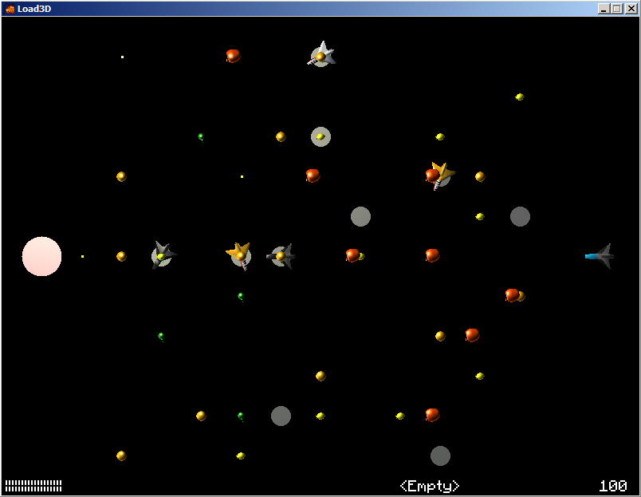
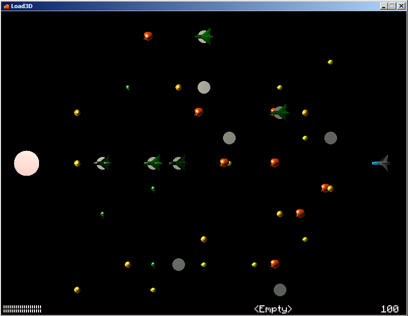
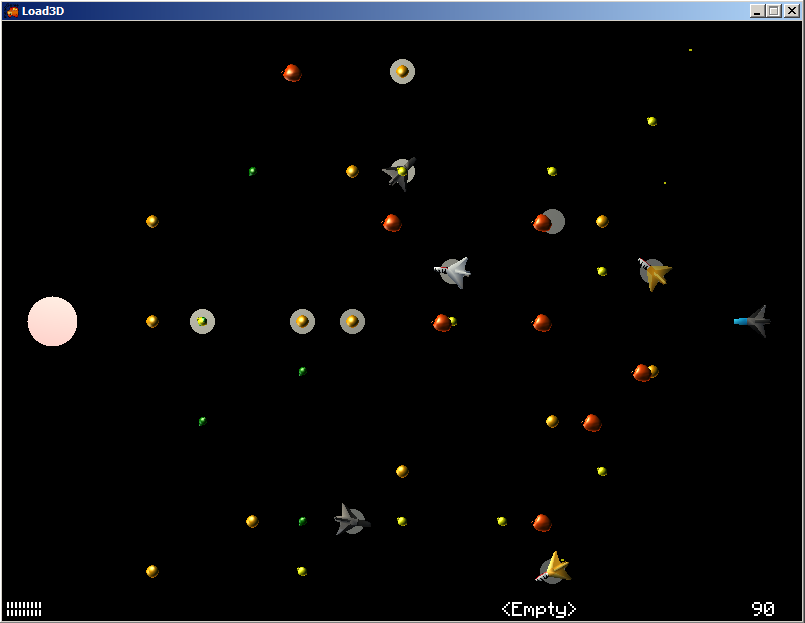
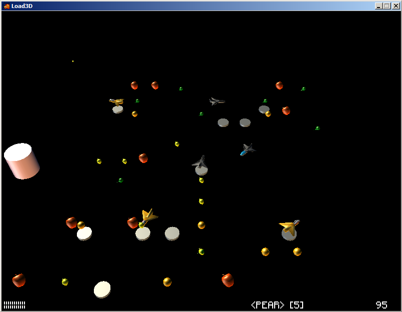
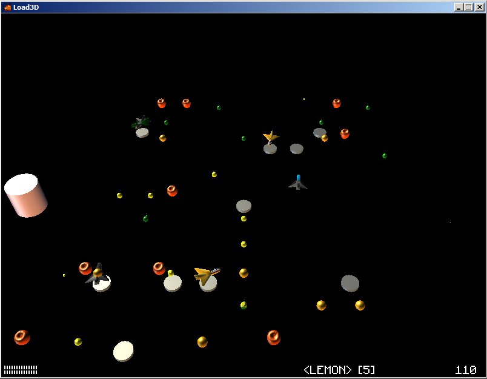
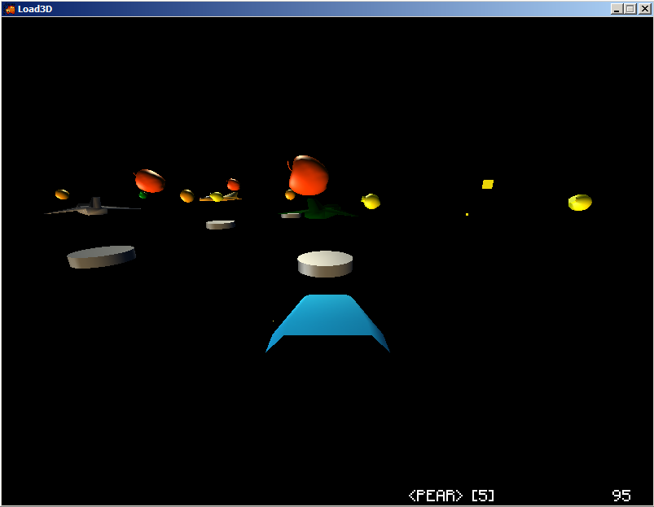
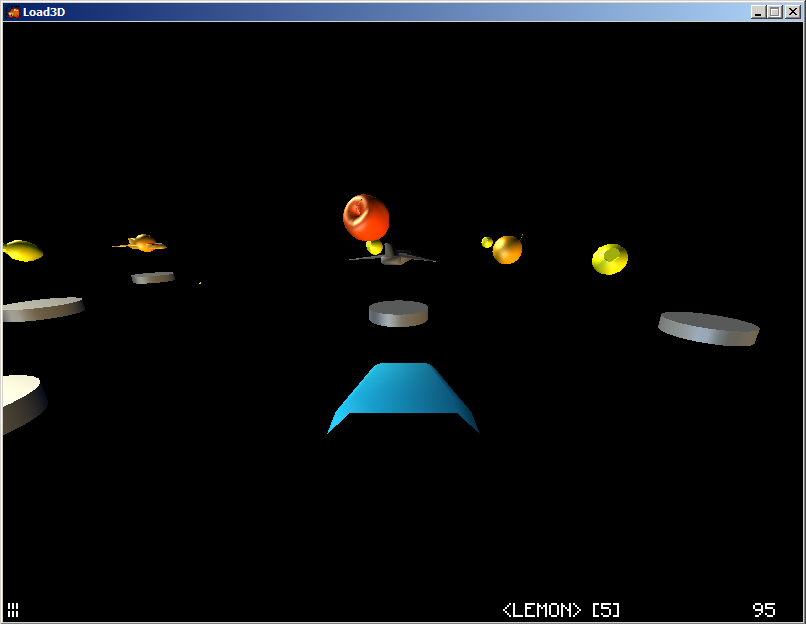

# Space Food Fight

Note: The project is too large, you can find it on Github at:
https://github.com/snwfog/foodfight3d

# Major Point:
- All the features in the assignment requirements were implemented
- The planes are moving from a pit to another, taking over the pits
- There are 3 view modes mapped to key 1, 2, 3
- The bullets follows parabolic path
- Somewhat good object oriented programming

# Bug/glitches:
- Sometime the matrix to spawn a new empty location seems to be not working as intended
- During long time play the plane will sometime spawn on top of one another if the pits number is low
